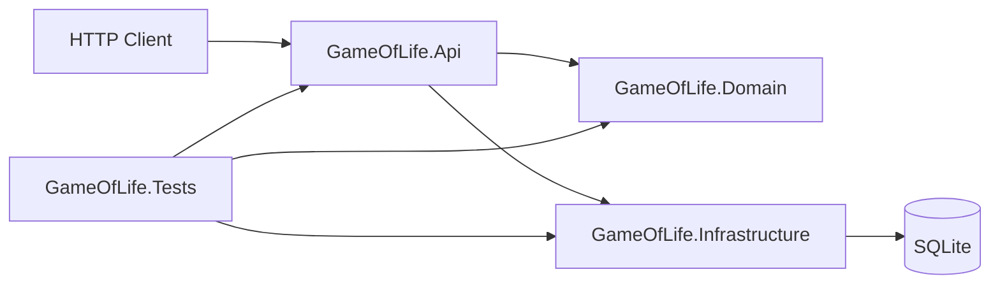
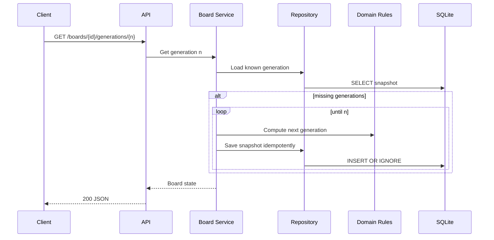

# Conway Game of Life API

An ASP.NET Core Minimal API implementation of Conway's Game of Life. The service accepts finite board states, persists them durably, computes future generations, and detects terminal conclusions for stable or cyclic patterns.

## Exercise Mapping

| Requirement | Implementation |
| --- | --- |
| Upload a new board state and return an id | `POST /boards` |
| Get next state for board | `GET /boards/{boardId}/generations/1` |
| Get x number of states away | `GET /boards/{boardId}/generations/{generation}` |
| Get final state or error after x attempts | `GET /boards/{boardId}/conclusion?maxAttempts=1000` |
| Survive restart/crash while retaining boards | SQLite persistence for uploaded boards and generated snapshots |
| Complete code and proof of completeness | Domain tests, API integration tests, persistence tests, and ADRs |

## Architecture



The API contract uses boolean matrices because they are familiar in academic and interview settings:

```json
{
  "cells": [
    [false, true, false],
    [false, true, false],
    [false, true, false]
  ]
}
```

Matrices are row-major: `cells[row][column]`, where row is `y`, column is `x`, and `true` means alive. Internally, states are normalized to sorted live-cell coordinates so hashing and persistence are deterministic.

## Request Flow



## API

### Create a board

```http
POST /boards
Content-Type: application/json

{
  "cells": [
    [false, true, false],
    [false, true, false],
    [false, true, false]
  ]
}
```

Returns `201 Created` with the board id, dimensions, generation `0`, and initial state.

### Get a board

```http
GET /boards/{boardId}
```

Returns board metadata and generation `0`.

### Get a generation

```http
GET /boards/{boardId}/generations/{generation}
```

Generation `1` is the next state. Larger values compute and persist any missing intermediate snapshots.

### Get a conclusion

```http
GET /boards/{boardId}/conclusion?maxAttempts=1000
```

Returns `stable` when a state repeats immediately, `cycle` when a prior state repeats after a period, or `422 ProblemDetails` when no conclusion is found within the attempt limit.

## Running

This repository targets `net10.0`. Install the .NET 10 SDK, then run:

```bash
dotnet restore
dotnet test
dotnet run --project src/GameOfLife.Api
```

Development endpoints:

- Scalar API reference: `http://localhost:5088/scalar/v1`
- OpenAPI JSON: `http://localhost:5088/openapi/v1.json`
- Health check: `http://localhost:5088/health`

The repository also includes [requests/game-of-life.http](requests/game-of-life.http), an IDE-friendly request collection for exercising the API without a browser UI.

## Completeness Evidence

- Domain logic is isolated from HTTP and SQLite.
- SQLite stores uploaded boards and derived generation snapshots.
- Generation writes are idempotent, so concurrent requests may duplicate compute work but not corrupt persisted state.
- Tests cover Game of Life rules, still lifes, oscillators, API contracts, validation, no-conclusion behavior, and restart-style persistence.
- ADRs in `docs/decisions` record the major architecture decisions and tradeoffs.
